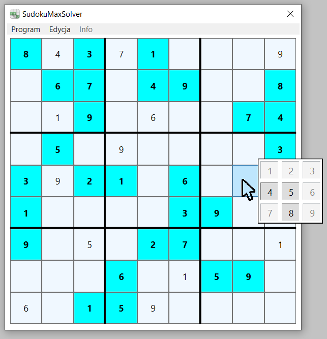

# SudokuMaxSolver
Mini project written in c # Visual Studio / C# / WPF

Download applications here -> [SudokuMaxSolver.exe](./SudokuMaxSolver/bin/Debug/SudokuMaxSolver.exe)

It is a unique project on a global scale.
I saw only one of these on the website.
The project is created only by me and I do not use any outside help because such help does not exist.
I am looking for solutions and creating my own algorithms for manual Sudoku solving.
In the future, I plan to rewrite the program for android.

## The program is under construction :
### Was completed
* dynamic generation of buttons (9x9) and popup (3x3) on the window
* generating sudoku with a certain degree of difficulty (easy..impossible)
* generating the correct board (has only one solution)
* short menu with icons
* brute force sudoku solution (add separate static function to be used in other projects)
* sudoku solution (brute force)
* sudoku solution with steps and description :
- [x] method 01 - TheOnlyPossible
- [x] method 02 - SingleCandidateInRow
- [x] method 03 - SingleCandidateInColumn
- [x] method 04 - SingleCandidateInSquare
- [ ] method 05 - Twins
### What else needs to be done
* board analysis (checking how many solutions there are (method is finished)), determining the degree of difficulty)
* sudoku solution with steps and description
* I have to come up with new methods for solving difficult SUDOKU and then develop algorithms

## Screen from 04.09.2020 :
 